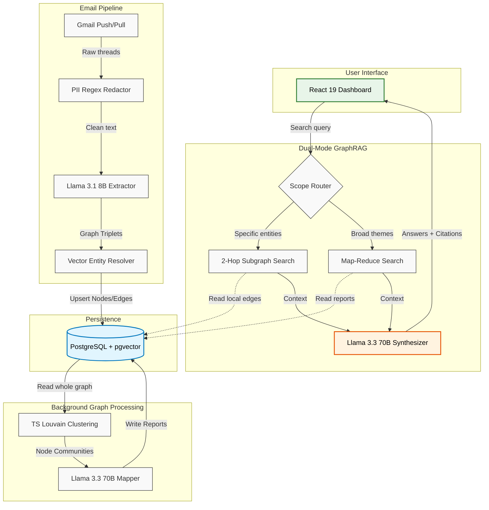

# Tasker: Corporate Email GraphRAG Engine

Tasker is a production-grade backend and React dashboard built to sync unstructured corporate emails and transform them into a searchable, relational knowledge graph.

By running community detection and dual-mode GraphRAG, the system answers complex user questions about internal projects, contacts, and tasks, complete with inline citations linking back to original email threads.

## Technical Architecture

At a high level, Tasker separates the ingestion of real-time emails from the heavy lifting of background graph generation and user querying.

### 1. Database and Storage
- **PostgreSQL**: Hosted on Supabase. Stores graph nodes (contacts, tasks), edges (relationships), and thread metadata.
- **pgvector**: Powers high-performance HNSW indexing on 384-dimensional vector embeddings, enabling fast semantic search.

### 2. Backend Orchestration (Deno Edge Functions)
- **Zero-Retention Ingestion**: Raw email bodies are heavily redacted for PII, summarized into semantic triplets (subject, predicate, object), and then discarded. We only keep the graph edges and short snippets.
- **Canonical Entity Resolution**: Combines fast case-insensitive exact matching with vector similarity to deduplicate contacts. If a user emails "John Doe" and "jdoe@company.com", they map to one canonical entity.
- **Edge-Native Louvain Clustering**: Instead of spinning up Python microservices, Tasker uses a custom TypeScript implementation of the Louvain modularity algorithm directly inside Deno (under 256MB memory) to group graph nodes into dense communities.

### 3. LLM Integration Pipeline
- **Local Models**: Supabase AI `gte-small` runs locally for embedding generation without network overhead.
- **Remote Models**: Groq API provides high-throughput inference. We use Llama 3.1 8B for fast, cheap entity extraction, and Llama 3.3 70B for deep reasoning during the final GraphRAG synthesis.

### 4. React Frontend Dashboard
- Built with React 19 and Vite.
- Implements a clean bento grid layout with D3.js force-directed graphs for visualizing communication networks.

---

## The User Flow

When a user signs up and links their Google Workspace:

1. **Authentication and Webhooks**: Google OAuth completes, and the system registers a Google Cloud Pub/Sub webhook. This watches the inbox for real-time delivery events.
2. **Historical Queueing**: A background worker performs a historical sync, governed by a self-healing concurrency lock (Redis-style TTL in Postgres) to prevent race conditions.
3. **Data Extraction**: Emails are batched, filtered for spam/promotions, redacted, and fed to Llama 3.1 to extract graph triplets. 
4. **Clustering**: In the background, the edge-native Louvain algorithm builds network communities. Llama 3.3 generates a structured report summarizing the themes of each community.
5. **Dashboard Exploration**: The user logs in to search their communication history, track actionable tasks, and browse sender biographies.

---

## Scaled System Diagram

Below is the conceptual flow of data from ingestion through to the user's browser.

### Deep Dive: Dual-Mode GraphRAG

A standard RAG pipeline fails on holistic questions like "What are the main engineering bottlenecks this quarter?" because vector search only retrieves locally similar chunks. Tasker solves this using two distinct routing paths:

- **Local Mode (Neighborhood Search)**: When a user asks about a specific person or project, the system queries `pgvector` for the top 5 relevant emails. It then expands the search by 2 hops in the Postgres graph to pull in connected tasks, contacts, and historical threads. This bounded subgraph is fed to the LLM to construct a precise, well-cited answer.
- **Global Mode (Map-Reduce)**: When a user asks a broad thematic question, the system retrieves the auto-generated Community Reports. It runs parallel Map queries against Llama 3.1 to extract relevant insights from each report independently. A final Reduce step aggregates these partial answers using Llama 3.3 into a comprehensive executive summary. 

This hybrid approach ensures high accuracy for both pinpoint queries and broad organizational analysis while keeping latency low.
