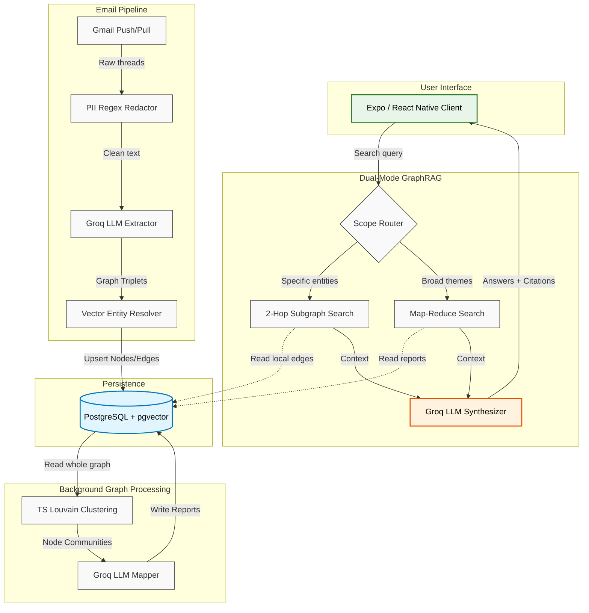

<p align="center">
  
</p>

# Tasker AI

[](LICENSE)
[](https://expo.dev)
[](https://supabase.com)

Tasker AI is a cross-platform (web + mobile), AI-powered email intelligence platform that helps users stay on top of their inbox without manually reading every conversation. It analyzes email threads, extracts tasks, deadlines, pending replies, and project information, then organizes them into a structured workspace. Rather than relying only on keyword search or simple summarization, Tasker AI understands the context shared across conversations, making it easier to track work, prioritize actions, and find relevant information when it's needed.

## What Problem Does It Solve?

People spend a significant amount of time searching through email threads, tracking commitments, remembering follow-ups, and connecting related conversations. Important tasks often get buried under newsletters, notifications, and long email chains.

Tasker AI eliminates this friction by automatically extracting meaningful information and presenting it in a clear, prioritized workspace.

## Core Features

- **Action Item Extraction** — Detects tasks, deadlines, approvals, and follow-ups from emails.
- **Context Awareness** — Understands relationships between people, projects, and conversations instead of analyzing emails in isolation.
- **Priority Dashboard** — Organizes work into categories such as:
  - Projects
  - Personal Emails
  - Action Insights
  - Pending Requests
  - Priority Items
- **Semantic Search** — Find information based on meaning rather than exact keywords.
- **Relationship Mapping** — Connects related emails across long conversations to provide complete context.
- **AI Summaries** — Condenses lengthy email threads into concise, actionable summaries.

## Technical Architecture

At a high level, Tasker separates the ingestion of real-time emails from the heavy lifting of background graph generation and user querying.

### 1. Database and Storage
- **PostgreSQL**: Hosted on Supabase. Stores graph nodes (contacts, tasks), edges (relationships), and thread metadata.
- **pgvector**: Powers high-performance HNSW indexing on 384-dimensional vector embeddings, enabling fast semantic search.

### 2. Backend Orchestration (Deno Edge Functions)
- **Zero-Retention Ingestion**: Raw email bodies are heavily redacted for PII, summarized into semantic triplets (subject, predicate, object), and then discarded. We only keep the graph edges and short snippets.
- **Canonical Entity Resolution**: Combines fast case-insensitive exact matching with vector similarity to deduplicate contacts. If a user emails "John Doe" and "jdoe@company.com", they map to one canonical entity.
- **Edge-Native Louvain Clustering**: Instead of spinning up Python microservices, Tasker uses a custom TypeScript implementation of the Louvain modularity algorithm directly inside Deno (under 256MB memory) to group graph nodes into dense communities.

### 3. LLM Integration Pipeline
- **Local Models**: Supabase AI `gte-small` runs locally for embedding generation without network overhead.
- **Remote Models**: Groq API provides high-throughput inference for both fast entity extraction/categorization and deeper reasoning during profile synthesis and final GraphRAG answers.

### 4. Cross-Platform Client (`TaskerAI/`)
- Built with Expo Router + React Native (Expo ~54, React 19) — a single codebase ships to web, iOS, and Android.
- Zustand handles client state; Nativewind (Tailwind for React Native) handles styling.
- Implements a dashboard with task lists, an AI panel, and a knowledge graph browser for visualizing communication networks.

---

## The User Flow

When a user signs up and links their Google Workspace:

1. **Authentication and Webhooks**: Google OAuth completes, and the system registers a Google Cloud Pub/Sub webhook. This watches the inbox for real-time delivery events.
2. **Historical Queueing**: A background worker performs a historical sync, governed by a self-healing concurrency lock (Redis-style TTL in Postgres) to prevent race conditions.
3. **Data Extraction**: Emails are batched, filtered for spam/promotions, redacted, and fed to a Groq-hosted model to extract graph triplets. 
4. **Clustering**: In the background, the edge-native Louvain algorithm builds network communities. A Groq-hosted model generates a structured report summarizing the themes of each community.
5. **Dashboard Exploration**: The user logs in to search their communication history, track actionable tasks, and browse sender biographies.

---

## Scaled System Diagram

Below is the conceptual flow of data from ingestion through to the user's browser.



### Deep Dive: Dual-Mode GraphRAG

A standard RAG pipeline fails on holistic questions like "What are the main engineering bottlenecks this quarter?" because vector search only retrieves locally similar chunks. Tasker solves this using two distinct routing paths:

- **Local Mode (Neighborhood Search)**: When a user asks about a specific person or project, the system queries `pgvector` for the top 5 relevant emails. It then expands the search by 2 hops in the Postgres graph to pull in connected tasks, contacts, and historical threads. This bounded subgraph is fed to the LLM to construct a precise, well-cited answer.
- **Global Mode (Map-Reduce)**: When a user asks a broad thematic question, the system retrieves the auto-generated Community Reports. It runs parallel Map queries against a Groq-hosted model to extract relevant insights from each report independently. A final Reduce step aggregates these partial answers into a comprehensive executive summary. 

This hybrid approach ensures high accuracy for both pinpoint queries and broad organizational analysis while keeping latency low.

---

## Project Structure

```
TaskerAI/           Active client — Expo Router + React Native (web, iOS, Android)
supabase/functions/ Deno edge functions — sync pipeline, PII redaction, GraphRAG queries, webhooks
supabase/migrations/ SQL schema and RPC migrations
execution/           Scripts and edge-function-adjacent execution layer
directives/          SOPs the assistant/orchestration layer follows
diagnostics/         One-off debug/eval scripts (PII redaction tuning, JWT checks)
docs/                Deep-dive guides (design system, PII redaction engine, mobile OAuth bridge)
archive/             Superseded docs, one-off scripts, and the deprecated Vite/React frontend — kept for history, not maintained
```

## Quick Start

Prerequisites: Node.js, the [Supabase CLI](https://supabase.com/docs/guides/cli), and Expo Go (or an iOS/Android simulator) for mobile.

```bash
# Client
cd TaskerAI
npm install
npm run web       # or: npm run android / npm run ios

# Backend (Supabase edge functions)
cd supabase
supabase start
supabase functions serve
```

Set your own Supabase project URL/keys, Google OAuth credentials, and LLM provider key as environment variables / Supabase project secrets before running — see `docs/` for service-specific setup (PII redaction engine, mobile OAuth bridge).

## Contributing

See [CONTRIBUTING.md](CONTRIBUTING.md).

## License

[MIT](LICENSE)
