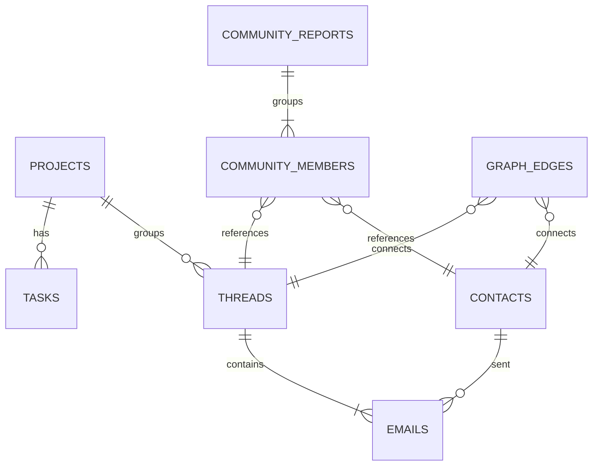

# Implementation Plan: Tasker Corporate — Context-Aware Email GraphRAG

Pivoting the Tasker application into a context-aware corporate email productivity tool. We replace isolated email processing with a **Context-Aware Email Knowledge Graph** using a hybrid Vector + GraphRAG pipeline, and build a unified multi-platform frontend in **Flutter** (targeting Web, Android, and iOS).

---

## User Review Required

> [!IMPORTANT]
> **1. Multi-Platform Frontend Shift to Flutter:**
> We are deprecating the React/Vite web application in `frontend/` and bootstrapping a new multi-platform app in `frontend_flutter/` using Flutter and `supabase_flutter`. This will compile natively to Web, Android (Google Play Store), and iOS (Apple App Store).
>
> **2. Entity Resolution & Deduplication:**
> To solve naming variations (e.g., "Acme Corp" vs "Acme Corporation", or "John Doe" vs "John"), we are implementing a two-step entity resolution process:
> - Case-insensitive exact name matching.
> - Embedding similarity matching (cosine distance < 0.15) for names/descriptions of the same type.
> When a duplicate is resolved, the system merges their descriptions and updates all existing edges to point to the canonical node.
>
> **3. Deno-Native Louvain Clustering:**
> Since Python libraries like `graspologic` or `networkx` are unavailable in Deno Edge Functions, we will implement a modularity-based Louvain clustering algorithm natively in TypeScript. This runs asynchronously after email syncs and writes communities to `community_reports` and memberships to `community_members`.
>
> **4. Cost-Optimized Search query latency:**
> Running Map-Reduce (Global Search) over all communities is slow and expensive. We will pre-filter the community reports by embedding similarity to the user's query, selecting only the top 5-10 relevant communities for the map step.

---

## Strategic Decisions

- **Thread Sync Depth (Incremental Graph Accumulation):** 
  * *Decision:* **Incremental extraction with historical graph retention**. When a thread is first synced, we fetch the last 20 messages to build the initial context. When a new email arrives, we *only* fetch and process the new message. Since previous entities, tasks, and relationships are already persisted in the Postgres graph, the system resolves the new message's entities against this existing graph history. This keeps LLM token costs and processing latency low while preserving full historical context.
- **Manual vs. Dynamic Projects (Suggested-and-Pinned Model):**
  * *Decision:* **Hybrid project management**. Users can manually define projects (e.g., "Project Apollo"). GraphRAG's Louvain community detection runs in the background to cluster threads and tasks into dynamic topics (e.g., "API Integration discussions with Acme"). If a dynamic topic has high overlap with a manual project, the UI automatically links them. Unlinked topics are surfaced as "Suggested Focus Areas" that users can promote to a manual project with one click.

---

## Proposed Database Schema (v2)

We will introduce a relational property graph model in PostgreSQL alongside the existing `tasks` table.



### Tables

1. **`contacts`**: Represents senders and recipients.
   - `id` uuid PRIMARY KEY DEFAULT gen_random_uuid()
   - `email` text UNIQUE NOT NULL
   - `name` text
   - `organization` text
   - `bio_summary` text (compiled dynamically by LLM based on emails)
   - `embedding` vector(1536) (of the name + bio description for resolution)
   - `created_at` timestamptz DEFAULT now()

2. **`projects`**: Represents corporate projects, focus areas, or topics.
   - `id` uuid PRIMARY KEY DEFAULT gen_random_uuid()
   - `name` text UNIQUE NOT NULL
   - `description` text
   - `status` text DEFAULT 'active'
   - `created_at` timestamptz DEFAULT now()

3. **`threads`**: Grouping of related messages.
   - `id` uuid PRIMARY KEY DEFAULT gen_random_uuid()
   - `gmail_thread_id` text UNIQUE NOT NULL
   - `subject` text
   - `semantic_summary` text
   - `project_id` uuid REFERENCES projects(id) ON DELETE SET NULL
   - `created_at` timestamptz DEFAULT now()

4. **`emails`**: Individual messages.
   - `id` uuid PRIMARY KEY DEFAULT gen_random_uuid()
   - `message_id` text UNIQUE NOT NULL
   - `thread_id` uuid REFERENCES threads(id) ON DELETE CASCADE
   - `sender_id` uuid REFERENCES contacts(id) ON DELETE RESTRICT
   - `subject` text
   - `body` text
   - `snippet` text
   - `received_at` timestamptz NOT NULL
   - `embedding` vector(1536) (for semantic similarity queries)
   - `created_at` timestamptz DEFAULT now()

5. **`community_reports`**: Clustering output for GraphRAG.
   - `id` uuid PRIMARY KEY DEFAULT gen_random_uuid()
   - `title` text NOT NULL
   - `summary` text NOT NULL (LLM generated executive summary)
   - `rating` numeric NOT NULL (E.2 priority/urgency rating between 0-10)
   - `rating_explanation` text NOT NULL (E.2 rating rationale sentence)
   - `findings` jsonb NOT NULL (structured E.2 findings array with data reference citations)
   - `embedding` vector(1536) (for query relevance filtering)
   - `created_at` timestamptz DEFAULT now()

6. **`community_members`**: Link nodes to clusters.
   - `id` uuid PRIMARY KEY DEFAULT gen_random_uuid()
   - `community_id` uuid REFERENCES community_reports(id) ON DELETE CASCADE
   - `node_id` uuid NOT NULL
   - `node_type` text NOT NULL (e.g. 'contact', 'project', 'thread', 'task')

7. **`graph_edges`**: Connects entities in the graph.
   - `id` uuid PRIMARY KEY DEFAULT gen_random_uuid()
   - `source_id` uuid NOT NULL
   - `target_id` uuid NOT NULL
   - `source_type` text NOT NULL
   - `target_type` text NOT NULL
   - `relationship_type` text NOT NULL (e.g. `SENT_BY`, `PART_OF`, `TRIGGERS`, `ASSIGNED_TO`, `RELATES_TO`, `COLLABORATES_WITH`)
   - `description` text NOT NULL (explaining the specific connection context)
   - `created_at` timestamptz DEFAULT now()

---

## Proposed Changes

### Component 1: Supabase Database Migration

#### [NEW] [011_add_graphrag_tables.sql](file:///c:/Users/rikku/OneDrive/Desktop/tasker/execution/db_migrations/011_add_graphrag_tables.sql)
- Initializes the v2 schema tables: `contacts`, `projects`, `threads`, `emails`, `graph_edges`, `community_reports`, `community_members`.
- Extends the existing `tasks` table with foreign keys `project_id` and `assignee_id`.
- Creates pgvector indexes (`hnsw` or `ivfflat`) on `emails.embedding`, `contacts.embedding`, and `community_reports.embedding` for fast similarity search.
- Enables Row Level Security (RLS) policies allowing select reads for authenticated users and full modifications for `service_role`.

---

### Component 2: Backend Graph Engine (Deno Edge Functions)

#### [NEW] [graph.ts](file:///c:/Users/rikku/OneDrive/Desktop/tasker/supabase/functions/_shared/graph.ts)
- **Deno-Native `GraphRAGExtractor` Class**:
  We implement a custom TypeScript class `GraphRAGExtractor` in `graph.ts` that acts as the core extraction component, matching the Python equivalent but running natively on Deno Edge Functions. It executes chunks of email body text in parallel, parses delimiter-separated output (since Groq is optimized for delimiter-separated formats over structured JSON for complex schemas), and returns structured entity and relation models.
  
  ```typescript
  export interface ExtractedEntity {
    name: string;
    type: 'CONTACT' | 'PROJECT' | 'TASK' | 'TOPIC' | 'EMAIL_THREAD' | 'ORGANIZATION';
    description: string;
  }

  export interface ExtractedRelationship {
    source: string;
    target: string;
    relation: 'SENT_BY' | 'PART_OF' | 'TRIGGERS' | 'ASSIGNED_TO' | 'RELATES_TO' | 'COLLABORATES_WITH';
    description: string;
    strength: number; // 1-10 strength score
  }

  export interface ExtractionResult {
    entities: ExtractedEntity[];
    relationships: ExtractedRelationship[];
  }

  export class GraphRAGExtractor {
    private groqApiKey: string;
    private model: string;
    private numWorkers: number;
    private extractPrompt: string;

    constructor(options: { groqApiKey: string; model?: string; numWorkers?: number }) {
      this.groqApiKey = options.groqApiKey;
      this.model = options.model || "meta-llama/llama-3.3-70b-specdec";
      this.numWorkers = options.numWorkers || 4;
      this.extractPrompt = KG_TRIPLET_EXTRACT_TMPL; // E.1 Prompt defined below
    }

    /**
     * Extracts entities and relationships from a single raw text chunk using Groq completions.
     */
    async extractChunk(text: string): Promise<ExtractionResult> {
      try {
        const response = await fetch("https://api.groq.com/openai/v1/chat/completions", {
          method: "POST",
          headers: {
            "Authorization": `Bearer ${this.groqApiKey}`,
            "Content-Type": "application/json",
          },
          body: JSON.stringify({
            model: this.model,
            messages: [
              { role: "system", content: this.extractPrompt },
              { role: "user", content: text }
            ],
            temperature: 0.1,
          }),
        });

        if (!response.ok) throw new Error(`Groq API Error: ${response.status}`);
        const data = await response.json();
        const rawContent = data.choices?.[0]?.message?.content || "";
        return this.parseTriplets(rawContent);
      } catch (e) {
        console.error("Chunk extraction failed:", e);
        return { entities: [], relationships: [] };
      }
    }

    /**
     * Processes all chunks concurrently with a worker limit (concurrency control).
     */
    async extractBatch(chunks: string[]): Promise<ExtractionResult[]> {
      const results: ExtractionResult[] = [];
      const executing = new Set<Promise<void>>();

      for (const chunk of chunks) {
        const p = this.extractChunk(chunk);
        results.push(p as any);

        const e: Promise<void> = p.then(() => { executing.delete(e); });
        executing.add(e);

        if (executing.size >= this.numWorkers) {
          await Promise.race(executing);
        }
      }
      return Promise.all(results);
    }

    /**
     * Parses the delimiter-separated custom format:
     * ("entity"|<name>|<type>|<description>)##("relationship"|<source>|<target>|<relation>|<description>|<strength>)
     */
    private parseTriplets(content: string): ExtractionResult {
      const entities: ExtractedEntity[] = [];
      const relationships: ExtractedRelationship[] = [];
      
      const records = content.split("##");
      for (const record of records) {
        // Clean parentheses
        const cleanRecord = record.trim().replace(/^\(|\)$/g, "");
        const parts = cleanRecord.split("|");
        const type = parts[0]?.replace(/"/g, "").trim().toLowerCase();

        if (type === "entity") {
          const [_, name, entType, description] = parts;
          if (name && entType) {
            entities.push({
              name: name.trim().toUpperCase(),
              type: entType.trim().toUpperCase() as any,
              description: description ? description.trim() : "",
            });
          }
        } else if (type === "relationship") {
          const [_, source, target, relation, description, strengthStr] = parts;
          if (source && target && relation) {
            relationships.push({
              source: source.trim().toUpperCase(),
              target: target.trim().toUpperCase(),
              relation: relation.trim().toUpperCase() as any,
              description: description ? description.trim() : "",
              strength: strengthStr ? parseInt(strengthStr.trim(), 10) || 5 : 5,
            });
          }
        }
      }

      return { entities, relationships };
    }
  }
- **Tuned Groq System Prompt (E.1 Delimiter-Separated Format)**:
  ```text
  ---Goal---
  Given a set of corporate emails, identify all entities of the defined types and all relationships among those identified entities.
  
  ---Entity Types---
  - CONTACT: Name of individuals (e.g. "JOHN DOE", "ALICE SMITH"). Senders, recipients, or individuals mentioned.
  - ORGANIZATION: Company, organization, or team names (e.g. "ACME CORP", "TASKER", "DESIGN TEAM").
  - PROJECT: Internal or collaborative projects, initiatives, code repositories (e.g. "PROJECT APOLLO", "FLUTTER MIGRATION").
  - TASK: Actionable request, assignment, deadline, checklist, or scheduled meeting (e.g. "REFACTOR GRAPH API", "WEEKLY DEMO").
  - EMAIL_THREAD: The subject line or name of the email thread context (e.g. "RE: DESIGN PATTERNS REVIEW").
  - TOPIC: Broader business themes, departments, domains, or recurring subjects (e.g. "SECURITY COMPLIANCE", "HIRING", "CUSTOMER SUPPORT").
  
  ---Relationship Types---
  - SENT_BY: Connects an EMAIL_THREAD or TASK to the CONTACT who sent the email or authored/proposed the task.
  - PART_OF: Connects a sub-entity to its parent (e.g., TASK PART_OF PROJECT, CONTACT PART_OF ORGANIZATION, PROJECT PART_OF ORGANIZATION).
  - TRIGGERS: Connects an EMAIL_THREAD or TASK to a subsequent TASK or EMAIL_THREAD it initiates (e.g., email thread triggers a task).
  - ASSIGNED_TO: Connects a TASK or PROJECT to a CONTACT who is designated to execute it.
  - RELATES_TO: A general fallback connection for related entities of any type.
  - COLLABORATES_WITH: Connects two CONTACT nodes (or two ORGANIZATION nodes) that are collaborating or working together.
  
  ---Steps---
  1. Identify all entities. For each identified entity, extract:
     - entity name: Name of the entity, capitalized (e.g. "JOHN DOE", "PROJECT APOLLO"). Senders and recipients are CONTACT nodes.
     - entity type: One of the following types: [CONTACT, PROJECT, TASK, TOPIC, EMAIL_THREAD, ORGANIZATION]
     - entity description: Comprehensive description of the entity's attributes and activities from the text, including specific roles, email context, and timelines.
     Format each entity as: ("entity"|<entity name>|<entity type>|<entity description>)
  
  2. From the entities identified in step 1, identify all pairs of (source entity, target entity) that are *clearly related*.
     For each pair of related entities, extract:
     - source entity: name of the source entity, as identified in step 1
     - target entity: name of the target entity, as identified in step 1
     - relationship type: One of: [SENT_BY, PART_OF, TRIGGERS, ASSIGNED_TO, RELATES_TO, COLLABORATES_WITH]
     - relationship description: Explanation of why the relationship exists, with specific email context and details of the collaboration, assignment, or trigger.
     - relationship strength: An integer score between 1 and 10 representing the strength of the relationship (e.g. 10 for direct assignment, 1 for loose mention).
     Format each relationship as: ("relationship"|<source entity>|<target entity>|<relationship type>|<relationship description>|<relationship strength>)
  
  3. Format the final output as a single list of all entities and relationships, separated by the record delimiter "##". Do not include any other markdown formatting, headers, or explanations. Just return the raw tuples separated by "##".
     Example:
     ("entity"|ALICE SMITH|CONTACT|Lead engineer for API platform at Tasker)##("entity"|PROJECT APOLLO|PROJECT|API design overhaul for Tasker)##("entity"|ACME CORP|ORGANIZATION|External vendor partnering for API integration)##("relationship"|ALICE SMITH|PROJECT APOLLO|ASSIGNED_TO|Alice is the lead engineer assigned to Project Apollo|10)##("relationship"|PROJECT APOLLO|ACME CORP|RELATES_TO|Project Apollo involves integration work with external vendor Acme Corp|7)
  ```
- **Entity Resolution Layer**:
  - When an entity is extracted, searches the database for existing matches.
  - If a case-insensitive exact name match exists, resolves to it.
  - Otherwise, queries the `contacts` or `projects` table using vector cosine similarity (threshold < 0.15). If a match is found, merges the descriptions and uses the existing node ID.
  - Updates all incoming/outgoing edges in `graph_edges` to point to the resolved canonical node.
- **Deno-Native `GraphRAGStore` Class**:
  We implement a custom TypeScript class `GraphRAGStore` in `graph.ts` that encapsulates the graph persistence, clustering, and community summary generation. Instead of inheriting from LlamaIndex stores, it interacts directly with our Supabase PostgreSQL schema, building a virtual memory graph, executing modularity-based Louvain clustering, and writing reports back to the database.

  ```typescript
  export interface CommunityMemberInfo {
    nodeId: string;
    nodeType: 'contact' | 'thread' | 'task' | 'project';
    name: string;
    description: string;
  }

  export interface CommunityDetails {
    members: CommunityMemberInfo[];
    relationships: string[];
  }

  export class GraphRAGStore {
    private supabase: any;
    private groqApiKey: string;
    private summaryModel: string;

    constructor(supabaseClient: any, options: { groqApiKey: string; summaryModel?: string }) {
      this.supabase = supabaseClient;
      this.groqApiKey = options.groqApiKey;
      this.summaryModel = options.summaryModel || "meta-llama/llama-3.1-8b-instant";
    }

    /**
     * Main pipeline task: runs community detection and generates summaries.
     */
    async buildCommunities(): Promise<void> {
      console.log("Starting community detection pipeline...");
      
      // 1. Fetch all nodes and edges from Supabase
      const { nodes, edges } = await this.fetchGraphFromDb();
      if (nodes.length === 0) {
        console.warn("⚠️ Graph is empty — no communities to build");
        return;
      }

      // 2. Execute Louvain clustering in TypeScript
      const clusters = this.runLouvainClustering(nodes, edges);
      
      // 3. Collect and format detailed community information (members + relationships)
      const communityInfo = this.collectCommunityInfo(nodes, edges, clusters);

      // 4. Generate summaries using the LLM and write them to the DB
      await this.generateAndSaveSummaries(communityInfo);
      console.log("✅ Community summaries and memberships rebuilt successfully");
    }

    private async fetchGraphFromDb(): Promise<{ nodes: any[]; edges: any[] }> {
      // Fetches contacts, threads, tasks, and graph_edges from the database
      // Returns mapped nodes with ID, name, type, and description/summary properties
    }

    private runLouvainClustering(nodes: any[], edges: any[]): Map<string, string> {
      // Computes community partition map: nodeId -> communityId
      // Employs a modularity-based Louvain algorithm implemented directly in TypeScript
    }

    private collectCommunityInfo(nodes: any[], edges: any[], clusters: Map<string, string>): Map<string, CommunityDetails> {
      const communityMap = new Map<string, CommunityDetails>();
      
      // Group members by community ID
      for (const node of nodes) {
        const cid = clusters.get(node.id) || "orphan";
        if (!communityMap.has(cid)) {
          communityMap.set(cid, { members: [], relationships: [] });
        }
        communityMap.get(cid)!.members.push({
          nodeId: node.id,
          nodeType: node.type,
          name: node.name,
          description: node.description || "",
        });
      }

      // Collect relationships where both endpoints belong to the same community
      for (const edge of edges) {
        const sourceCid = clusters.get(edge.source_id);
        const targetCid = clusters.get(edge.target_id);
        
        if (sourceCid && sourceCid === targetCid) {
          const detail = communityMap.get(sourceCid)!;
          const srcName = nodes.find(n => n.id === edge.source_id)?.name || edge.source_id;
          const tgtName = nodes.find(n => n.id === edge.target_id)?.name || edge.target_id;
          
          // Format: "Entity A --[RELATION]--> Entity B (description)"
          let entry = `${srcName} --[${edge.relationship_type}]--> ${tgtName}`;
          if (edge.description) {
            entry += ` (${edge.description})`;
          }
          detail.relationships.push(entry);
        }
      }

      return communityMap;
    }

    private async generateAndSaveSummaries(communityInfo: Map<string, CommunityDetails>): Promise<void> {
      // For each community:
      //  1. Construct prompt by injecting entities/descriptions and relationships list
      //  2. Invoke Groq API with the tuned E.2 Community Summary prompt
      //  3. Parse the generated JSON report
      //  4. Upsert report to community_reports and member records to community_members
    }
  }
  - **Tuned Groq E.2 Community Summary Prompt**:
    ```text
    ---Role---
    You are an AI corporate analyst helping a manager understand email threads, projects, and tasks within a specific communication cluster.
    
    ---Goal---
    Write a comprehensive report of a community (cluster), given a list of entities (contacts, projects, tasks, threads, organizations) and their relationships. The report will inform decision-makers about active discussions, pending deadlines, collaborations, and blockers.
    
    ---Report Structure---
    Return output as a well-formed JSON string with the following schema:
    {
      "title": <report title representing key projects/contacts>,
      "summary": <executive summary of active discussions, threads, and tasks>,
      "rating": <priority/urgency rating as a float between 0.0 and 10.0, where 10.0 is a critical outage or immediate blocker, and 0.0 is informational spam>,
      "rating explanation": <one-sentence explanation of the priority rating>,
      "findings": [
        {
          "summary": <insight summary, e.g. "API Integration blocker with Acme">,
          "explanation": <detailed explanatory text of the insight, grounded with data references like [Data: Entities (ids); Relationships (ids)]>
        }
      ]
    }
    
    ---Relationship Analysis Rules---
    When analyzing the community, explicitly inspect:
    - Senders (SENT_BY relationships) to identify who initiated key email threads and proposed actions.
    - Team structure (PART_OF relationships) to map contacts to their organizations and projects.
    - Task assignments (ASSIGNED_TO relationships) to track who is responsible for pending deliverables.
    - Triggers (TRIGGERS relationships) to follow dependencies between emails and follow-up tasks.
    - Collaborations (COLLABORATES_WITH relationships) to assess partnership dynamics.
    
    ---Grounding Rules---
    All statements must be backed by the input data records. Include references like:
    "Alice is waiting for John's approval on the database schema [Data: Entities (1, 2); Relationships (10, 11)]."
    Do not list more than 5 record IDs in a single reference. Use "+more" if there are more.
    Do not make up facts or include information without supporting evidence.
    ```
  - Saves the resulting JSON properties (`title`, `summary`, `rating`, `rating explanation`, `findings`) along with community embeddings to `community_reports`.

#### [MODIFY] [_shared/stages.ts](file:///c:/Users/rikku/OneDrive/Desktop/tasker/supabase/functions/_shared/stages.ts)
- Integrates context retrieval in the task extraction step (`extractRawTasks`).
- Fetches thread history and sender biography from the database to inject into the extraction prompt.
- Asks the LLM to output both extracted tasks and property graph triplets in the custom tuple format.

#### [MODIFY] [sync/index.ts](file:///c:/Users/rikku/OneDrive/Desktop/tasker/supabase/functions/sync/index.ts)
- Ingests incoming emails into `emails`, `threads`, and `contacts` before calling task extraction.
- Saves extracted relationships (including `strength` scores) into `graph_edges` once task extraction completes.
- Launches the `rebuildCommunities()` background process asynchronously via Deno `fireAndForget`.

#### [NEW] [query/index.ts](file:///c:/Users/rikku/OneDrive/Desktop/tasker/supabase/functions/query/index.ts)
- **Deno-Native `GraphRAGQueryEngine` Class**:
  We implement a custom TypeScript class `GraphRAGQueryEngine` to execute the query workflows. This class supports two search architectures: **Global Search (Map-Reduce)** over community summaries, and **Local Search (Neighborhood Search)** over localized graph neighborhoods.

  ```typescript
  export class GraphRAGQueryEngine {
    private supabase: any;
    private groqApiKey: string;
    private mapModel: string;
    private reduceModel: string;

    constructor(supabaseClient: any, options: { groqApiKey: string; mapModel?: string; reduceModel?: string }) {
      this.supabase = supabaseClient;
      this.groqApiKey = options.groqApiKey;
      this.mapModel = options.mapModel || "meta-llama/llama-3.1-8b-instant";
      this.reduceModel = options.reduceModel || "meta-llama/llama-3.3-70b-specdec";
    }

    /**
     * Executes a Global Map-Reduce query across community summaries.
     */
    async queryGlobal(queryStr: string): Promise<string> {
      // 1. Embed queryStr and find top relevant community reports via vector cosine similarity
      const communities = await this.retrieveRelevantCommunities(queryStr);
      if (communities.length === 0) {
        return "No relevant community reports found.";
      }

      // 2. Map step: Get answers from each community in parallel
      const mapPromises = communities.map(comm => this.answerFromCommunity(comm, queryStr));
      const rawAnswers = await Promise.all(mapPromises);
      
      // Filter out irrelevant responses
      const relevantAnswers = rawAnswers.filter(ans => ans && ans.trim().length > 0 && !ans.toLowerCase().includes("no relevant information"));
      if (relevantAnswers.length === 0) {
        return "I don't have enough relevant community information to answer this question.";
      }

      // 3. Reduce step: Aggregate into a single well-structured final answer
      return this.aggregateAnswers(relevantAnswers, queryStr);
    }

    /**
     * Executes a Local neighborhood search by traversing graph edges.
     */
    async queryLocal(queryStr: string): Promise<string> {
      // 1. Vector similarity search on emails table to find top 5 relevant messages
      const relevantEmails = await this.retrieveRelevantEmails(queryStr);
      if (relevantEmails.length === 0) {
        return "No matching emails found.";
      }

      // 2. Retrieve the neighborhood subgraph: traverse graph_edges up to 2 hops
      const subgraph = await this.fetchLocalNeighborhood(relevantEmails);

      // 3. Ask reduceModel (llama-3.3-70b) to synthesize a response grounded in this local subgraph
      return this.generateLocalAnswer(subgraph, queryStr);
    }

    private async retrieveRelevantCommunities(queryStr: string): Promise<any[]> {
      // Calls edge function embeddings and runs database vector search on community_reports
    }

    private async answerFromCommunity(community: any, query: string): Promise<string> {
      const prompt = `Community summary:\n${community.summary}\n\nQuestion: ${query}\n\n` +
        `If this summary contains information relevant to the question, answer it. ` +
        `If not relevant, reply exactly: 'No relevant information.'\n\nAnswer:`;
      
      const response = await this.callLLM(this.mapModel, prompt);
      return response;
    }

    private async aggregateAnswers(answers: string[], query: string): Promise<string> {
      const combined = answers.join("\n\n---\n\n");
      const prompt = `You have received answers from multiple knowledge graph communities about this question:\n\n` +
        `Question: ${query}\n\nCommunity answers:\n${combined}\n\n` +
        `Synthesise these into a single, clear, well-structured final answer. ` +
        `Remove redundancy, keep all important details, and ensure the answer directly addresses the question.\n\n` +
        `Final Answer:`;
      
      return this.callLLM(this.reduceModel, prompt);
    }

    private async retrieveRelevantEmails(queryStr: string): Promise<any[]> {
      // Performs vector search on emails.embedding table
    }

    private async fetchLocalNeighborhood(emails: any[]): Promise<any> {
      // Query graph_edges connecting to contacts, threads, tasks within 2 hops of these emails
      // Returns entities list and structured relationship formats
    }

    private async generateLocalAnswer(subgraph: any, query: string): Promise<string> {
      // Prompts Groq with the formatted neighborhood subgraph to synthesize the answer
    }

    private async callLLM(model: string, prompt: string): Promise<string> {
      // Helper to fetch Groq completions API
    }
  }
  ```

#### [NEW] [index.ts](file:///c:/Users/rikku/OneDrive/Desktop/tasker/supabase/functions/graph-debug/index.ts)
- **Graph Diagnostics & Inspection Endpoint**:
  Exposes a secure, authenticated edge function to inspect raw Groq extractions, list entities, and traverse localized graph neighborhoods. This replaces local Python debugging notebooks.
  - `POST /graph-debug?action=extract-sample`: Accepts raw text and returns the parsed entities and relationships *without* saving to the database, enabling quick ontology validation.
  - `GET /graph-debug?action=list-entities`: Returns all contacts, threads, and projects.
  - `GET /graph-debug?action=inspect-node&name=NAME`: Resolves the entity by name and returns its type, description, and its 1-hop connections in `graph_edges` mapped back to source and target names.

---

### Component 3: Existing React Frontend Enhancements

#### [MODIFY] [App.jsx](file:///c:/Users/rikku/OneDrive/Desktop/tasker/frontend/src/App.jsx)
- **State Additions**:
  - `activeTab` ('tasks' | 'graph' | 'directory'): Tracks current root view.
  - `directorySubTab` ('contacts' | 'projects'): Tracks sub-view inside Directory.
  - `searchMode` ('local' | 'global'): Selects the GraphRAG search mode.
  - `graphMessages` (Array): Store history of chat queries and responses.
  - `graphInput` (string): Text value for the input query.
  - `graphLoading` (boolean): Query execution spinner flag.
  - `activeCitation` (object): Selected email thread citation shown in detail modal.
  - `directoryLoading` (boolean), `contactsList` (Array), `projectsList` (Array), `communitiesList` (Array): For contacts and projects directory data.
  - `directorySearchQuery` (string): For search/filter functionality in Directory lists.
- **Tab Layout & Rendering**:
  - Render an `.app-tabs` navigation bar right below `<header className="app-header">...</header>`.
  - Conditional rendering:
    - **Tasks View**: The original categories loop (grouped and filtered pending tasks).
    - **Graph Console**:
      - Switchable search mode headers with descriptions for Global vs Local Search.
      - A message list window rendering user queries and assistant responses.
      - Formatted responses displaying lists, headers, bold text, and clickable `[Thread: Subject]` badges.
      - Input field with keyboard listener (`Enter` key submits) and a Send button.
    - **Contacts & Projects Directory**:
      - Sub-tab header to switch between "Contacts & Biographies" and "Projects & Focus Areas".
      - Search/filter input to filter listings dynamically in real time.
      - Contacts list rendering Name, Organization, Email, and dynamic `bio_summary`.
      - Projects list rendering:
        - Manual Projects: Name, Status, Description.
        - Dynamic Clusters: Title, priority rating value (colored badge), summary description, and bulleted findings.
- **Inline Citation Parser**:
  - Evaluates assistant messages using regex `/\[Thread:\s*([^\]]+)\]/g`.
  - Replaces matches with a styled `<button className="citation-badge">` component.
  - Clicking this badge matches the subject name to `citations` returned from Supabase, setting `activeCitation`.
- **Context Modal**:
  - Displayed as a modal dialog overlay when `activeCitation` is present.
  - Renders subject, sender contact, date (formatted), semantic summary snippet, and an outbound Gmail link.

#### [MODIFY] [index.css](file:///c:/Users/rikku/OneDrive/Desktop/tasker/frontend/src/index.css)
- **App Tabs Layout**: Glassmorphic tab bar container with active state borders, scaling transitions, and hover glow.
- **Cognitive Graph Console**:
  - Centered chat workspace styled as a high-density terminal grid panel.
  - Search mode toggle switches with slider handles and neon glass borders.
  - Message bubble structures: AI bubble with subtle bronze border (`var(--accent-glow)`) and user bubble with mid-navy backing.
- **Citation Badges**: Inline capsules with hover scaling, cursor pointers, and subtle accent shadows.
- **Context Modal Details**: Fullscreen backdrop filter overlay, bento-grid card centered, close button, formatted meta-fields, and button links.
- **Directory Layout**: Two-column responsive bento layouts for contacts and projects directories. Highlighting priority ratings on Louvain communities using HSL color logic (Red-Yellow-Green ranges).
- **Search Filters**: Minimal glassmorphic text input boxes with internal search icons.

---

## Verification Plan

### Automated Tests
1. **Database Migration Test**:
   - Verify migration applies cleanly on local Postgres/Supabase instance.
2. **Graph Ingestion & Community Detection**:
   - Write a Deno test script (`test-graph-ingest.ts`) to ingest mock emails, run the Louvain community clustering engine, and assert that nodes are correctly grouped and reports are created.
3. **Query Engine Verification**:
   - Write a test suite (`test-graph-queries.ts`) that executes three core query scenarios to verify semantic aggregation and traversal:
     - **Scenario A: Corporate Thematic Analysis (Global Search / Map-Reduce)**
       - *Query:* "What are the main operational issues or project updates discussed across our vendor emails?"
       - *Expectation:* Aggregates findings from multiple community reports (e.g. Acme Corp discussions, Tasker team internal status reports).
     - **Scenario B: Cross-Entity Relationship Analysis (Local Search / 2-Hop Traversal)**
       - *Query:* "Which external organizations are involved in our project dependencies, and what are their active assignments or blockers?"
       - *Expectation:* Resolves organization entities (e.g., Acme Corp), traverses `COLLABORATES_WITH` and `ASSIGNED_TO` relationships, and details positions.
     - **Scenario C: Comparative Project Analysis (Hybrid Search)**
       - *Query:* "How do the timelines and scope of Project Apollo compare to the Flutter Migration project?"
       - *Expectation:* Compares task statuses, deliverables, and assigned contacts for both projects.
4. **React Frontend Compile Test**:
   - Run `npm run build` inside `frontend/` directory to ensure no compilation or TypeScript/JSX bundle errors.

### Manual Verification
1. Sync a test Gmail account, check that the property graph is ingested with relations, and verify community reports are created.
2. Query the GraphRAG console for general themes (e.g., "What are the active disputes or discussions with external vendors?") and click citation links to confirm they lead to the correct email threads.
3. Call the `graph-debug` endpoint with various inspect commands (`GET /graph-debug?action=inspect-node&name=...`) to verify that the extracted relationships match actual email threads.
