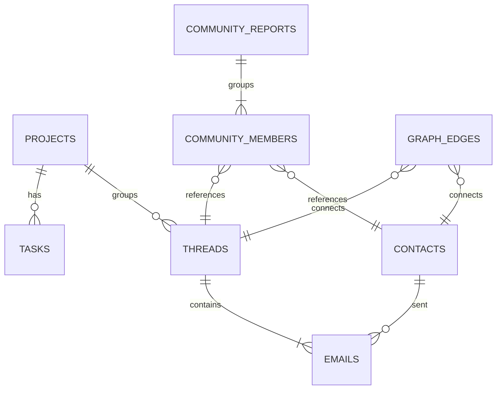

# Data Model: Relational Property Graph

This document details the Supabase PostgreSQL database tables and relationships used to store the property graph and community clustering reports.

## Entity-Relationship Diagram

## Table Specifications

### 1. `contacts`
Represents individuals (senders, recipients, and people mentioned).
- `id` (uuid, PRIMARY KEY): Unique identifier.
- `email` (text, UNIQUE, NOT NULL): Redacted or canonical email.
- `name` (text): Normalized capitalized name.
- `organization` (text): Affiliation.
- `bio_summary` (text): Dynamic biography generated from email discussions.
- `embedding` (vector(1536)): Embedding of `name + biography` for name resolution.

### 2. `projects`
Represents focus areas or business initiatives.
- `id` (uuid, PRIMARY KEY): Unique identifier.
- `name` (text, UNIQUE, NOT NULL): Project name.
- `description` (text): Summary.
- `status` (text): `active` or `completed`.

### 3. `threads`
Groups related email messages.
- `id` (uuid, PRIMARY KEY): Unique identifier.
- `gmail_thread_id` (text, UNIQUE, NOT NULL): Gmail thread identifier.
- `subject` (text): Thread subject.
- `semantic_summary` (text): Dynamic summary of the email thread context.
- `project_id` (uuid, REFERENCES projects): Associated project.

### 4. `emails`
Individual email messages.
- `id` (uuid, PRIMARY KEY): Unique identifier.
- `message_id` (text, UNIQUE, NOT NULL): Message header identifier.
- `thread_id` (uuid, REFERENCES threads): Parent thread.
- `sender_id` (uuid, REFERENCES contacts): Sender.
- `subject` (text): Message subject.
- `body` (text): Email message content.
- `snippet` (text): Snippet preview.
- `received_at` (timestamptz, NOT NULL): Received date.
- `embedding` (vector(1536)): Text embedding of subject + snippet.

### 5. `community_reports`
Modularity-based Louvain clustering reports.
- `id` (uuid, PRIMARY KEY): Unique identifier.
- `title` (text, NOT NULL): Community name/theme.
- `summary` (text, NOT NULL): Executive summary report.
- `rating` (numeric, NOT NULL): Urgency/priority rating (0.0 to 10.0).
- `rating_explanation` (text, NOT NULL): Rationale for priority rating.
- `findings` (jsonb, NOT NULL): Array of structured findings.
- `embedding` (vector(1536)): Embedding of title + summary for semantic pre-filtering.

### 6. `community_members`
Maps nodes (entities) to their respective community report.
- `id` (uuid, PRIMARY KEY): Unique identifier.
- `community_id` (uuid, REFERENCES community_reports): Associated community.
- `node_id` (uuid, NOT NULL): UUID of the member node.
- `node_type` (text, NOT NULL): Member type (`contact`, `project`, `thread`, `task`).

### 7. `graph_edges`
Property graph connections between entities.
- `id` (uuid, PRIMARY KEY): Unique identifier.
- `source_id` (uuid, NOT NULL): Source node UUID.
- `target_id` (uuid, NOT NULL): Target node UUID.
- `source_type` (text, NOT NULL): Source type.
- `target_type` (text, NOT NULL): Target type.
- `relationship_type` (text, NOT NULL): Relationship type (e.g., `SENT_BY`, `ASSIGNED_TO`).
- `description` (text, NOT NULL): Connection context description.
