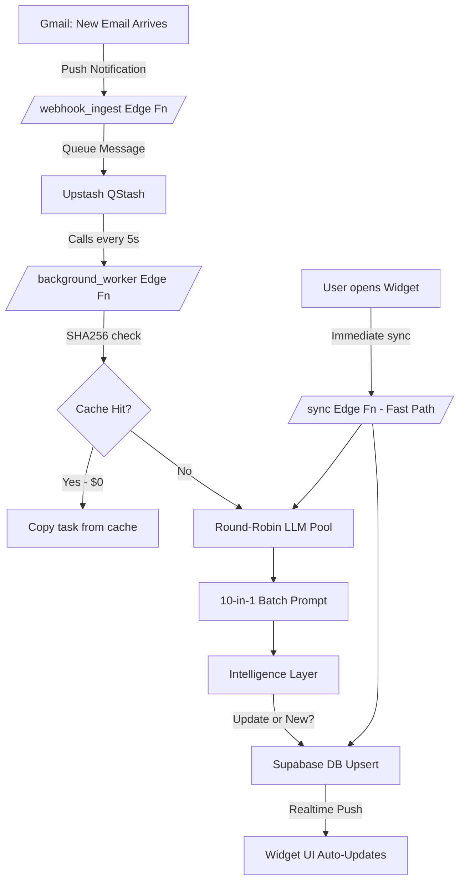

# Tasker v3: Final Architecture (Event-Driven + CQRS)

> Designed using `backend-architect`, `upstash-qstash`, and `ai-agents-architect` skills.
> **Capacity:** 180 RPM (3 API keys, round-robin) → 108,000 emails/hour.

---

## How It Works — The Full Flow



---

## 🏗️ Layer 1: Ingestion (Push Webhooks)

**Service:** `/webhook_ingest` Edge Function

- Gmail sends a **Google Pub/Sub** notification the moment an email arrives.
- The function fetches the email body, hashes it (`SHA256`), and publishes a **QStash message** with just the email metadata (NOT the raw email body — respects Rule 10 of some-changes.md).
- **Acknowledges immediately** (< 200ms) so Google doesn't retry.

---

## 🧵 Layer 2: Rate Flattener (QStash Queue)

**Service:** Upstash QStash

- QStash delivers messages to `/background_worker` at a controlled rate (1 call every 5s = 12/min baseline).
- Built-in **retry with exponential backoff** if the worker fails.
- **Dead Letter Queue (DLQ):** Failed messages after 3 retries are logged to `debug_logs` for inspection.
- **Deduplication key:** SHA256 hash prevents the same email being queued twice even if Gmail fires the webhook twice.

---

## ⚙️ Layer 3: The Worker (CQRS + Conveyor Belt)

**Service:** `/background_worker` Edge Function (triggered by QStash)

```
COMMAND SIDE (Writes):
  1. Pull next batch of 10 emails from queue (multi-user)
  2. SHA256 check → skip or process
  3. Heuristic Regex bouncer (junk filter)
  4. LLM call via round-robin key pool
  5. Intelligence Layer (update detection + category normalization)
  6. Upsert to DB

QUERY SIDE (Reads):
  - Widget subscribes to Supabase Realtime
  - Gets pushed new tasks the moment DB is written
```

---

## 🧠 Layer 4: Intelligence Layer (0 Extra API Calls)

All intelligence is injected into the **single batch LLM prompt** — no extra requests:

| Feature | How |
|---|---|
| **Update Detection** | Inject `pending_tasks` → LLM returns `is_update: true` + `task_id` to patch |
| **Dynamic Categories** | LLM invents contextual categories; backend normalizes with fuzzy matching |
| **Persona Evolution** | Fires only on first sync or >10 new emails. Separate LLM call, isolated to Key C |
| **Category Persistence** | New unique categories auto-saved to `user_settings` |

---

## 🔑 Layer 5: 3-Key LLM Round-Robin Pool

```typescript
const KEYS = [SARVAM_KEY_A, SARVAM_KEY_B, SARVAM_KEY_C]; // 180 RPM total
const key = KEYS[requestCount % 3]; // Round-robin
```

- **Key A & B:** Extraction batches (high volume)
- **Key C:** Persona Evolution only (low volume, isolated)
- **Circuit Breaker:** If Key A returns 429, skip to Key B immediately. Log and alert.

---

## 📡 Layer 6: Real-Time Widget Delivery

- Frontend subscribes to `supabase.channel('tasks').on('UPDATE', ...)` via WebSocket.
- When the background worker upserts tasks, the widget updates **silently** with no user action required.
- Fast Path (`/sync`) still available for manual refresh — uses same LLM pool.

---

## 📈 Scalability Numbers

| Metric | Value |
|---|---|
| LLM Capacity | 180 RPM (3 keys) |
| Emails per Hour | 108,000 |
| Requests per Returning User | 1 per 10 new emails |
| Requests per New User | ~2 (1 persona + 1 batch) |
| Deduplication Savings | Up to 90% for shared academic emails |

---

## ⚠️ Risks & Mitigations

| Risk | Mitigation |
|---|---|
| Google Pub/Sub fires duplicate webhook | QStash deduplication key (SHA256) |
| LLM key gets 429 | Circuit breaker → rotate to next key |
| Worker crashes mid-batch | QStash retries automatically (DLQ after 3 fails) |
| Category bubble duplicates (TECH PROJECT vs TECH PROJECTS) | Backend fuzzy normalization before DB write |
| Cross-user privacy leak in batch | Strict `[USER_ID: x][EMAIL_ID: y]` headers + post-processing validation |

---

## 🛠️ Files to Build/Modify

| File | Change |
|---|---|
| [sync.ts](file:///c:/Users/rikku/OneDrive/Desktop/tasker/supabase/sync.ts) (existing) | Add key rotation, inject pending tasks + categories into prompt |
| `webhook_ingest/index.ts` | NEW: Pub/Sub receiver, SHA256 hash, QStash publish |
| `background_worker/index.ts` | NEW: QStash consumer, Conveyor Belt logic, Intelligence Layer |
| [App.jsx](file:///c:/Users/rikku/OneDrive/Desktop/tasker/frontend/src/App.jsx) | Add Supabase Realtime subscription for silent widget updates |
